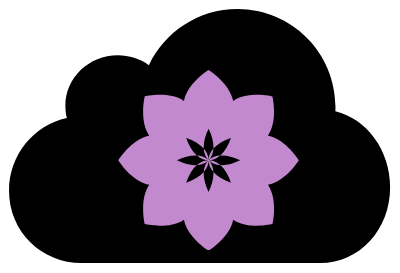

# Happy Frolicking!

The Free-Tier Frolic Project is designed to be an application to manage
the Big 3 public cloud providers free-tiers to minimize the surprise
billing when trying or developing on these clouds. 

This is project is being built live a couple times a week
at [CyberScythe's Youtube](https://www.youtube.com/channel/UCOrpbBZZ1wSLUUmLTQGjH6A)

## Goals and Info

We will create a monolithic App initially while taking into account
how we will move/tear it out into a microservice architecture. 

We are targeting to allow users to install Free-Tier Frolic on servers, but
allow the flexibility to deploy to Kubernetes or use Docker-Compose

Project Task List
====

### Frontend

- [ ] Application Login
- [ ] Landing/Cloud Connect
- [ ] Quick Start Page
- [ ] AWS Complete list
- [ ] Azure Complete list
- [ ] GCP Complete list
- [ ] Free-Tier Comparisons
- [ ] Cost Monitoring (Ensure Constrained to Free-Tier)

---
### Backend
- [ ] Alerting (Warn if approaching tier limits)
- [ ] Resource Shutdown
- [ ] Resource Provisioning
- [ ] API
- [ ] CLI 

---
### Deployment
- [ ] RPM
- [ ] APT
- [ ] SystemD
- [ ] Docker
- [ ] Kubernetes w/Openshift Support
